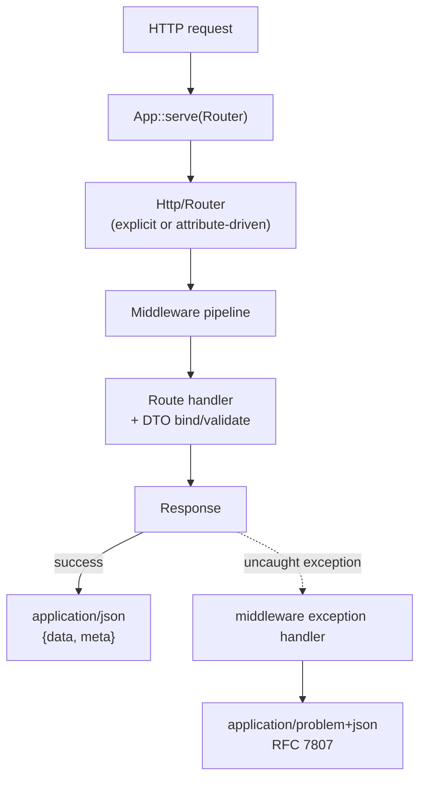

#### An opinionated JSON micro-framework for PHP.

##### Status: alpha. Targets PHP 8.2+.

Rxn (from "reaction") tries to land all three of **fast**,
**readable**, and **small** at the same time. The usual trilemma
("pick two") is real only when the three are treated as orthogonal
axes to optimise independently — they aren't. Bad design hurts all
three at once; good design helps all three at once. The
[design philosophy doc](docs/design-philosophy.md) is the working
theory.

The operational consequence is a single opinion: **strict
backend/frontend decoupling**. The backend is API-only, responds in
JSON, and rolls up every uncaught exception into a JSON error
envelope (RFC 7807 Problem Details). Frontends — web, mobile,
whatever — build against the versioned contracts and stay
decoupled. JSON-only is a *narrowing* decision that pays
dividends down the stack: no content negotiation, no view layer,
one error envelope.

Vendor-flavoured concerns ship as separate packages so the core
stays narrow:
- [`davidwyly/rxn-orm`](https://github.com/davidwyly/rxn-orm) —
  query builder + ActiveRecord-shaped layer.
- [`davidwyly/rxn-observe`](https://github.com/davidwyly/rxn-observe) —
  OpenTelemetry listener over the framework's PSR-14 event
  surface; drop in for span trees.

Both are opt-in via `composer require`; no plumbing in core, no
cost when not installed.

## At a glance



`App::serve(Router)` is the entry point — populate the Router
directly or from `#[Route]` attributes via `Http\Attribute\Scanner`.
The framework is boot-free: no constructor, no Container plumbing,
no DB connection during request setup.

See [`docs/index.md`](docs/index.md) for the full request sequence
and per-subsystem deep dives.

## Why Rxn

Five motives drive every decision in the framework:
**novelty, simplicity, interoperability, speed, and strict JSON.**

### Strict JSON

Every exit point — including uncaught exceptions — is a JSON
response. Slim / Lumen / Mezzio / API Platform all default to
JSON but still let controllers return HTML, XML, streams; that
flexibility forces a content-negotiation layer you can't opt out
of, and every app on top has to remember a surprising exception
can leak an HTML stack trace. Rxn removes the choice. Success
lands on `{data, meta}`; errors land on
`application/problem+json`. Two shapes, both machine-readable,
zero negotiation code.

### Interoperability

Errors are **RFC 7807 Problem Details**, not a bespoke envelope.
API gateways, Problem Details-aware client libraries, and error
aggregators already understand the shape; Rxn just emits what the
ecosystem expects. **OpenAPI 3 specs generate from reflection**
(`bin/rxn openapi`), so the contract is always in sync with the
code — hand the spec to any OpenAPI consumer (Redocly, client
generators). Drop in `Http\OpenApi\SwaggerUi::html($specUrl)`
from a route handler for instant interactive docs.

**PSR-native end-to-end.** PSR-7 ingress (default), PSR-15
middleware (the contract for all eight shipped middlewares),
PSR-11 container, PSR-3 logger, PSR-14 events — every framework
interface satisfies the relevant PSR. Any third-party CORS /
OAuth / OpenTelemetry / JWT / rate-limit middleware drops into
the `Pipeline`; pass the container to a PSR-11-aware library;
subscribe a PSR-14 listener to `IdempotencyHit` for replay-rate
dashboards. No adapters, no escape hatches — the framework's
contracts *are* the PSR contracts.

### Novelty

Opinionated pieces worth naming:

- **Typed DTO binding + attribute-driven validation.** Declare
  `public function create_v1(CreateProduct $input): array`, give
  `CreateProduct` public typed properties with `#[Required]`,
  `#[Min(0)]`, `#[Length(min: 1, max: 100)]`, etc., and the
  framework hydrates, casts, validates, and hands your action a
  populated instance — or fails the whole request with a 422
  Problem Details listing *every* field error at once. The same
  FastAPI-class ergonomic move that almost nothing in the PHP
  ecosystem ships natively, in ~250 LoC with no DSL.
- **Attribute routing + middleware** on the controller method:
  `#[Route('GET', '/products/{id:int}')]` and
  `#[Middleware(Auth::class)]` *are* the route table. No separate
  `routes.php` to drift out of sync.
- **Typed route constraints** (`{id:int}`, `{slug:slug}`,
  `{id:uuid}`, custom) so `/users/foo` falls through to 404
  instead of reaching a controller that has to validate and throw.
- **Compile-time route conflict detection.** `bin/rxn routes:check`
  flags ambiguous `#[Route]` patterns before they ship —
  `/items/{id:int}` vs `/items/{slug:slug}` (slug accepts
  digits) is a real conflict; the runtime would silently let
  whichever was registered first win and leave the other as
  dead code. CI catches it instead.
- **Reflection-driven OpenAPI + snapshot contract gate** — the
  framework knows your controllers; why duplicate that in a YAML
  file? DTO validation attributes map one-to-one to JSON Schema
  keywords, so the spec *can't* drift from the runtime behaviour
  — both sides read the same class. `bin/rxn openapi:check`
  closes the loop in CI: regenerate spec → diff against the
  committed snapshot → fail the build on breaking changes
  (operation removed, type changed, constraint tightened, …)
  unless the PR opts in. Schema-as-truth becomes
  schema-as-governance.
- **Production-safe by default** — stack traces never ship outside
  dev, boundary input sanitisation is one env flag, session
  cookies auto-flip to `Secure` behind an HTTPS proxy.

### Simplicity

Small enough to read end to end — **~11K LOC of framework code
ships what a comparably-featured Slim or Mezzio composition
reaches in 70–100K LOC of vendor packages** (DTO binding +
attribute-driven validation, OpenAPI from reflection, idempotency
middleware with three storage shapes, RFC 7807 envelope, eight
production middlewares, schema-compiled fast paths — all in one
repository). Slim is small because it offloads to the ecosystem;
Symfony is comprehensive because it doesn't. Rxn is small *and*
feature-dense — the schema-as-truth principle (one DTO drives
binding, validation, OpenAPI, and the compiled hydrator) is what
makes that arithmetic work.

Dependency-free, injectable-for-test middlewares for the common
defensive layers: **BearerAuth, CORS with preflight, ETag, JSON-
body decoding with size caps, Idempotency (Stripe-style replay),
Pagination, RequestId, TraceContext (W3C)**. DI container supports
**interface-to-implementation binding** (`$c->bind(UserRepo::class,
PostgresUserRepo::class)`) and factory closures, so serious apps
aren't stuck with autowire-only. An in-process **TestClient**
(`Rxn\Framework\Testing\TestClient`) fires requests at your Router
+ middleware stack and returns a `TestResponse` with PHPUnit-
integrated fluent assertions — no web server, no curl, no process
boundary. The ORM lives in a separate package
([`davidwyly/rxn-orm`](https://github.com/davidwyly/rxn-orm)) so
the framework itself stays narrow.

### Speed

Cross-framework HTTP throughput, PHP 8.4, `php -S` per-request
worker mode (full table + methodology in
[`bench/ab/CONSOLIDATION.md`](bench/ab/CONSOLIDATION.md)):

| Framework | GET /hello | GET /products/{id} | POST valid | POST 422 |
|---|---:|---:|---:|---:|
| **rxn** | **21,530** | **21,080** | **27,160** | **25,690** |
| symfony micro-kernel | 17,250 | 15,970 | 15,490 | 15,650 |
| raw PHP (no framework) | 17,140 | 16,930 | 17,080 | 17,120 |
| slim 4 | 13,800 | 13,780 | 13,460 | 13,480 |

**1.5–2× the throughput of Slim**, **1.25–1.75× Symfony**, and on
binder-driven POSTs **1.5–1.6× faster than hand-rolled raw PHP**
doing the same `json_decode` + manual validation. The
schema-compiled fast paths (`Validator::compile`,
`Binder::compileFor`, container factory cache) earn the gap;
PSR-7 ingress + `Binder::bindRequest(ServerRequestInterface)`
closes another 33–42% on POST cells vs the previous superglobal
path. p50 latency on the binder-heavy POST cell: 0.71ms (Slim:
1.47ms; raw PHP: 1.14ms).

How that's possible (the
[design philosophy](docs/design-philosophy.md) document is the long
version):

- **PSR-4 autoloading; no reflection on the hot path once caches
  warm.** Container caches reflection / construction plans /
  parsed-name lookups and compiles per-class factory closures —
  five stacked optimisations, transparent, ~2.2× cumulative.
- **Optional schema-compiled fast paths.** For long-lived workers
  (RoadRunner / Swoole / FrankenPHP), `Validator::compile($rules)`
  runs **2.45×** faster than the runtime path; `Binder::compileFor($class)`
  runs **6.4×** faster. Same APIs, two performance profiles.
- **OPcache preload script** ([`bin/preload.php`](bin/preload.php))
  for fpm cold-start latency.
- **File-backed query caching** (`Database::setCache()`) and
  **object file caching** with atomic writes for reflection-derived
  data.
- **ETag middleware** drops 304s for unchanged GETs before your
  controller serializes a byte of response.
- **No content-negotiation layer** to walk on every request.
- **Sync-first, process-per-request, predictable.** We deliberately
  don't chase async — PHP-FPM's process pool gives you concurrent-
  requests concurrency without the Fibers + event-loop +
  non-blocking-driver tax. Stack RoadRunner or Swoole under Rxn if
  you need in-request concurrency; the framework doesn't change
  shape for it (and the compile-path opt-ins above start paying
  for themselves there).

### How it stays this way

Every shipped optimisation has an A/B run with worktree-based
comparison, ranges, and a non-overlapping-range verdict
(`bench/ab.php`). Negative-result branches stay on origin with
their writeups. Sixteen experiments documented; eleven merged,
four documented as negative results, one shipped as
infrastructure.

The principles that produced those eleven wins are written down
in [`docs/design-philosophy.md`](docs/design-philosophy.md). The
cumulative scoreboard is in
[`bench/ab/CONSOLIDATION.md`](bench/ab/CONSOLIDATION.md).

## Quickstart

```bash
composer install
vendor/bin/phpunit          # 616 tests, 1321 assertions
bin/rxn help                # CLI subcommands
```

### Minimal app shape

The framework's entry point is `App::serve(Router)`. Boot-free —
no constructor, no Container plumbing, no DB connection during
request setup. A complete app:

```php
<?php declare(strict_types=1);
require __DIR__ . '/vendor/autoload.php';

use Rxn\Framework\App;
use Rxn\Framework\Http\Router;

$router = new Router();
$router->get('/products/{id:int}', function (array $params): array {
    return ['data' => ['id' => (int) $params['id']]];
});

App::serve($router);
```

Drop in front of `php -S` for local dev, or `php-fpm` + nginx /
Caddy / Apache for production. Apps that need DI / config /
logging wire those at the composition root and inject them into
handlers — the framework itself stays out of that decision.

### CI / cross-framework comparison

CI runs lint + phpunit against PHP 8.2, 8.3, and 8.4
(`.github/workflows/ci.yml`).

Test counts:

- **Rxn framework:** 616 tests / 1321 assertions (`vendor/bin/phpunit`).
- **[`davidwyly/rxn-orm`](https://github.com/davidwyly/rxn-orm)**
  (query builder): 68 tests / 132 assertions, run in that repo.
- **[`davidwyly/rxn-observe`](https://github.com/davidwyly/rxn-observe)**
  (OpenTelemetry listener): 9 tests / 26 assertions, run in that repo.

Cross-framework comparison harness
([`bench/compare/`](bench/compare/)) benchmarks Rxn against Slim 4,
a Symfony micro-kernel, and a raw-PHP baseline on identical routes
— pure PHP, no Docker. The full table is in
[`bench/ab/CONSOLIDATION.md`](bench/ab/CONSOLIDATION.md); the
methodology is in
[`bench/compare/README.md`](bench/compare/README.md).

## Documentation

| Topic | Where |
|---|---|
| Routing (convention + explicit patterns) | [`docs/routing.md`](docs/routing.md) |
| Dependency injection | [`docs/dependency-injection.md`](docs/dependency-injection.md) |
| Request binding + validation | [`docs/request-binding.md`](docs/request-binding.md) |
| Scaffolded CRUD | [`docs/scaffolding.md`](docs/scaffolding.md) |
| Error handling | [`docs/error-handling.md`](docs/error-handling.md) |
| Building blocks (Logger, RateLimiter, Scheduler, Auth, Pipeline, Router, Validator, Migration, Chain, query cache, PSR-7 bridge) | [`docs/building-blocks.md`](docs/building-blocks.md) |
| PSR-7 / PSR-15 interop — bench evidence behind the ingress cost analysis (page predates the PSR-15 native migration; see CHANGELOG) | [`docs/psr-7-interop.md`](docs/psr-7-interop.md) |
| Plugin architecture — what lives in core vs. as separate Composer packages | [`docs/plugin-architecture.md`](docs/plugin-architecture.md) |
| Horizons — research directions that could reposition the framework, each sized with cost and ship signal | [`docs/horizons.md`](docs/horizons.md) |
| CLI (`bin/rxn`) | [`docs/cli.md`](docs/cli.md) |
| Benchmarks (`bin/bench`) | [`docs/benchmarks.md`](docs/benchmarks.md) |
| Cross-framework comparison (Slim / Symfony / raw) | [`bench/compare/README.md`](bench/compare/README.md) |
| Contribution / style guide | [`CONTRIBUTING.md`](CONTRIBUTING.md) |

## Features

`[X]` = implemented and shipped, `[ ]` = on the roadmap.

- [ ] 80%+ unit test code coverage *(currently minimal; see
      `src/Rxn/**/Tests/` for what's covered)*
- [X] Gentle learning curve
   - [X] Installation through Composer
- [X] Simple workflow with an existing database schema
   - [X] Code generation
      - [X] CLI utility to create controllers and models
            (`bin/rxn make:controller`, `bin/rxn make:record`)
- [X] Database abstraction
   - [X] PDO for multiple database support
   - [X] Support for multiple database connections
- [X] Security
   - [X] Prepared statements everywhere — user values flow only
         through PDO bindings; identifiers come from schema
         reflection, never from request data
   - [X] Session cookies set with HttpOnly + SameSite=Lax; Secure
         flag flips on automatically when the request is HTTPS
         (including behind a trusted `X-Forwarded-Proto` proxy)
   - [X] Stack traces never leave the server in production —
         `Response::getFailure` strips file / line / trace
         fields when `ENVIRONMENT=production`
   - [X] Boundary input sanitization — control-character
         stripping on every GET / POST / header param when
         `APP_USE_IO_SANITIZATION=true` (JSON is the output
         format, so HTML-escaping stays in the frontend)
   - [X] Bearer-token authentication (`Http\Middleware\BearerAuth`):
         the framework extracts + verifies, the app supplies the
         token → principal resolver — by design, not a gap
   - [X] Rate limiting (`Utility\RateLimiter`, file-backed with
         `flock`)
- [X] Exception-driven error handling
   - [X] RFC 7807 Problem Details (`application/problem+json`) is
         the error shape, period — uncaught exceptions included.
         Dev-mode file/line/trace carry as `x-rxn-*` extension
         members
- [X] URI Routing — **explicit `Http\Router`**, driven directly
      or populated from `#[Route]` attributes
   - [X] Attribute-based routing — `#[Route('GET', '/products/{id:int}')]`
         + `#[Middleware(Auth::class)]` directly on controller methods
         via `Rxn\Framework\Http\Attribute\Scanner`; no separate
         route table
   - [X] Explicit pattern routing (`Rxn\Framework\Http\Router`) when
         attributes don't fit (programmatic groups, route generation
         from data, etc.)
   - [X] Typed route constraints (`{id:int}`, `{slug:slug}`,
         `{id:uuid}`, custom) — a non-matching URL just falls
         through to 404 instead of bubbling up as a controller-level
         validation error
   - [X] Compile-time route conflict detection (`bin/rxn routes:check`;
         `Http\Routing\ConflictDetector`) — flags ambiguous
         `#[Route]` patterns at CI time using a constraint-type
         compatibility matrix (e.g. `{id:int}` vs `{slug:slug}`
         both accept `"123"` → conflict; `{id:int}` vs
         `{name:alpha}` are disjoint). Exit 1 = conflicts found.
         No PHP framework I know of catches this before
         first-request resolution
- [X] Dependency Injection container
   - [X] Controller method injection
   - [X] DI autowiring via constructor type hints
   - [X] Interface → implementation binding
         (`$container->bind($abstract, $concrete)`) and factory
         closures (`$container->bind($abstract, fn ($c) => ...)`)
   - [X] Circular-dependency detection
- [X] Database / ORM concerns ship as
      [`davidwyly/rxn-orm`](https://github.com/davidwyly/rxn-orm)
      (query builder + ActiveRecord). `composer require` to opt in;
      no plumbing in core.
- [X] HTTP middleware pipeline — **PSR-15 native end-to-end**
      (`Http\Pipeline`; all eight shipped middlewares implement
      `Psr\Http\Server\MiddlewareInterface`)
   - [X] Shipped middlewares: BearerAuth, CORS w/ preflight,
         conditional GET via weak ETags + 304 short-circuit,
         Idempotency (Stripe-style replay), JSON-body decoding with
         size caps, Pagination + RFC 8288 Link headers, request-id
         correlation, **W3C Trace Context** (auto-propagation to
         outbound `Concurrency\HttpClient` calls) (`Http\Middleware\*`)
- [X] PSR-7 ingress — `Http\PsrAdapter::serverRequestFromGlobals()`
      builds a `ServerRequestInterface` from PHP globals;
      `App::serve(Router)` is the boot-free one-line front controller
- [X] **PSR-11** container, **PSR-3** logger, **PSR-14** event
      dispatcher — every framework interface satisfies the relevant
      PSR; drops into existing PSR-aware codebases without an
      adapter
- [X] Speed and performance
   - [X] PSR-4 autoloading
   - [X] File-backed query caching
   - [X] Object file caching (atomic writes)
- [X] Event logging (JSON-lines)
- [X] Scheduler (interval / predicate based)
- [X] Database migrations (`*.sql` runner)
- [ ] Mailer *(out of scope; use symfony/mailer or phpmailer)*
- [X] Request validation *(rule-based `Validator::assert`; see
      `Rxn\Framework\Utility\Validator`)*
   - [X] Typed DTO binding with attribute-driven validation —
         `Http\Binding\RequestDto` + `Http\Binding\Binder` +
         `#[Required]`, `#[Min]`, `#[Max]`, `#[Length]`,
         `#[Pattern]`, `#[InSet]`. All errors surface at once as a
         7807 `errors` extension member.
- [X] OpenAPI 3 spec generation from reflected controllers
      (`bin/rxn openapi`; `Http\OpenApi\Generator` + `Discoverer`)
   - [X] One-line interactive docs via
         `Http\OpenApi\SwaggerUi::html($specUrl)`
   - [X] DTO parameters emit as `requestBody` with validation
         attributes mapped to JSON Schema keywords (`#[Min]` →
         `minimum`, `#[Length]` → `minLength`/`maxLength`,
         `#[Pattern]` → `pattern`, `#[InSet]` → `enum`) — the same
         class drives both validation and the spec, so they can't
         drift
   - [X] Snapshot-tested contract gate (`bin/rxn openapi:check`;
         `Codegen\Snapshot\OpenApiSnapshot`) — diffs the generated
         spec against a committed `openapi.snapshot.json` and
         classifies drift as breaking (operation/parameter/property
         removals, type changes, tightened constraints, required-
         toggles) or additive (new operations, new optional fields,
         loosened constraints). Three exit codes for CI gating:
         0 clean, 1 additive only or `--allow-breaking` override,
         2 breaking detected
   - [X] Cross-language validator twin (`Codegen\JsValidatorEmitter`)
         — emits a vanilla ES module that agrees with `Binder::bind`
         on 0 disagreements / 10K random inputs across four fixture
         DTOs per CI run
   - [X] [Polyparity](https://github.com/davidwyly/polyparity)
         YAML exporter (`Codegen\PolyparityExporter`) — same DTO
         drives Rxn's PHP server, the JS twin, AND a polyparity
         spec consumable by polyparity's TS / Python / future-
         language siblings
- [X] In-process HTTP test client + fluent response assertions
      (`Testing\TestClient` + `TestResponse`) — no web server, no
      curl, PHPUnit-integrated failures
- [ ] Automated API request validation from contracts
- [ ] Optional, modular plug-ins

## License

Rxn is released under the permissive [MIT](https://opensource.org/licenses/MIT) license.
