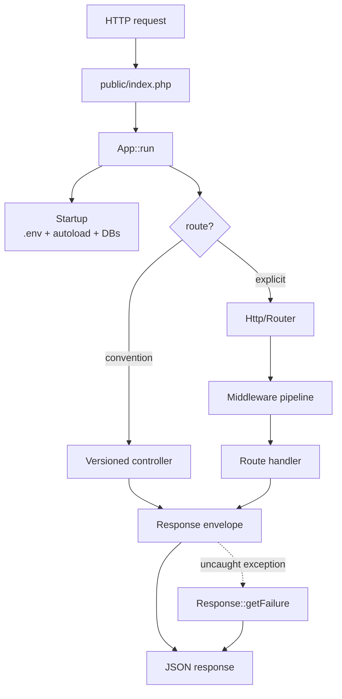

#### An opinionated JSON micro-framework for PHP.

##### Status: alpha. Targets PHP 8.2+ and ships a Docker stack on PHP 8.3-fpm.

Rxn (from "reaction") is built around a single opinion: **strict
backend/frontend decoupling**. The backend is API-only, responds in
JSON, and rolls up every uncaught exception into a JSON error
envelope. Frontends — web, mobile, whatever — build against the
versioned contracts and stay decoupled.

The framework aims, in order, to be **fast**, **small**, and
**easy to use**. The ORM / query builder lives in a separate
package — [`davidwyly/rxn-orm`](https://github.com/davidwyly/rxn-orm)
— pulled in automatically via Composer.

## At a glance



See [`docs/index.md`](docs/index.md) for the full request sequence
and per-subsystem deep dives.

## Quickstart

```bash
composer install
vendor/bin/phpunit          # run the test suite
composer validate --strict  # sanity-check composer.json
bin/rxn help                # list CLI subcommands
```

Full Docker stack (PHP 8.3-fpm + nginx 1.27 + MySQL 8):

```bash
cp docker-compose.env.example .env
# edit .env: set MYSQL_PASSWORD and MYSQL_ROOT_PASSWORD
docker compose up --build
```

Set `INSTALL_XDEBUG=1` in `.env` to build the PHP image with Xdebug 3.

CI runs lint + phpunit against PHP 8.2, 8.3, and 8.4 plus an
end-to-end HTTP smoke job against MySQL 8
(`.github/workflows/ci.yml`).

Current test counts:

- **Rxn framework:** 141 tests / 312 assertions (`vendor/bin/phpunit`).
- **[`davidwyly/rxn-orm`](https://github.com/davidwyly/rxn-orm)**
  (query builder): 68 tests / 132 assertions, run in that repo.

## Documentation

| Topic | Where |
|---|---|
| Routing (convention + explicit patterns) | [`docs/routing.md`](docs/routing.md) |
| Dependency injection | [`docs/dependency-injection.md`](docs/dependency-injection.md) |
| Scaffolded CRUD | [`docs/scaffolding.md`](docs/scaffolding.md) |
| Error handling | [`docs/error-handling.md`](docs/error-handling.md) |
| Building blocks (Logger, RateLimiter, Scheduler, Auth, Pipeline, Router, Validator, Migration, Chain, query cache, PSR-7 bridge) | [`docs/building-blocks.md`](docs/building-blocks.md) |
| CLI (`bin/rxn`) | [`docs/cli.md`](docs/cli.md) |
| Benchmarks (`bin/bench`) | [`docs/benchmarks.md`](docs/benchmarks.md) |
| Contribution / style guide | [`CONTRIBUTING.md`](CONTRIBUTING.md) |

## Features

`[X]` = implemented and shipped, `[ ]` = on the roadmap.

- [ ] 80%+ unit test code coverage *(currently minimal; see
      `src/Rxn/**/Tests/` for what's covered)*
- [X] Gentle learning curve
   - [X] Installation through Composer
- [X] Simple workflow with an existing database schema
   - [X] Code generation
      - [X] CLI utility to create controllers and models
            (`bin/rxn make:controller`, `bin/rxn make:record`)
- [X] Database abstraction
   - [X] PDO for multiple database support
   - [X] Support for multiple database connections
- [X] Security
   - [X] Prepared statements everywhere — user values flow only
         through PDO bindings; identifiers come from schema
         reflection, never from request data
   - [X] Session cookies set with HttpOnly + SameSite=Lax; Secure
         flag flips on automatically when the request is HTTPS
         (including behind a trusted `X-Forwarded-Proto` proxy)
   - [X] Stack traces never leave the server in production —
         `Response::getFailure` strips file / line / trace
         fields when `ENVIRONMENT=production`
   - [X] Boundary input sanitization — control-character
         stripping on every GET / POST / header param when
         `APP_USE_IO_SANITIZATION=true` (JSON is the output
         format, so HTML-escaping stays in the frontend)
   - [X] CSRF synchronizer tokens (`Session::token()` /
         `Session::validateToken()`) with constant-time compare
   - [X] Bearer-token authentication (`Service\Auth`): the
         framework extracts + verifies, the app supplies the
         token → principal resolver — by design, not a gap
   - [X] Rate limiting (`Utility\RateLimiter`, file-backed with
         `flock`)
- [X] Exception-driven error handling
- [X] Versioning (versioned controllers + actions)
- [X] Scaffolding (version-less CRUD against a live schema)
- [X] URI Routing
   - [X] Convention-based (`/v{N}/{controller}/{action}/key/value/...`)
   - [X] Explicit pattern routing (`Rxn\Framework\Http\Router`)
   - [X] Apache 2 (.htaccess)
   - [X] NGINX (see `docker/nginx`)
- [X] Dependency Injection container
   - [X] Controller method injection
   - [X] DI autowiring via constructor type hints
   - [X] Circular-dependency detection
- [X] Object-Relational Mapping
   - [X] Query builder (SELECT / INSERT / UPDATE / DELETE with
         subqueries, upsert, RETURNING) — ships as
         [`davidwyly/rxn-orm`](https://github.com/davidwyly/rxn-orm)
   - [X] ActiveRecord hydration + hasMany / hasOne / belongsTo
         relationships (`Rxn\Framework\Model\ActiveRecord`)
   - [X] Scaffolded CRUD on a record (`CrudController` + `Record`)
   - [X] FK relationship graph (`Data\Chain` + `Link`)
- [X] HTTP middleware pipeline *(both Rxn-native and PSR-15; see
      `Http\Pipeline` / `Http\Psr15Pipeline`)*
   - [X] Shipped middlewares: CORS w/ preflight, request-id
         correlation, JSON-body decoding with size caps (see
         `Http\Middleware\{Cors,RequestId,JsonBody}`)
- [X] PSR-7 bridge *(`Http\PsrAdapter::serverRequestFromGlobals()` /
      `::emit()`; ecosystem middleware drops in via Psr15Pipeline)*
- [X] Speed and performance
   - [X] PSR-4 autoloading
   - [X] File-backed query caching
   - [X] Object file caching (atomic writes)
- [X] Event logging (JSON-lines)
- [X] Scheduler (interval / predicate based)
- [X] Database migrations (`*.sql` runner)
- [ ] Mailer *(out of scope; use symfony/mailer or phpmailer)*
- [X] Request validation *(rule-based `Validator::assert`; see
      `Rxn\Framework\Utility\Validator`)*
- [ ] Automated API request validation from contracts
- [ ] Optional, modular plug-ins

## License

Rxn is released under the permissive [MIT](https://opensource.org/licenses/MIT) license.
