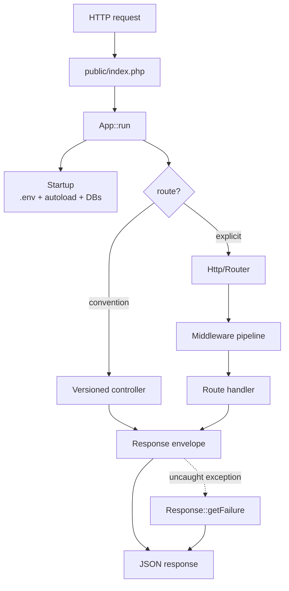

#### An opinionated JSON micro-framework for PHP.

##### Status: alpha. Targets PHP 8.2+ and ships a Docker stack on PHP 8.3-fpm.

Rxn (from "reaction") is built around a single opinion: **strict
backend/frontend decoupling**. The backend is API-only, responds in
JSON, and rolls up every uncaught exception into a JSON error
envelope. Frontends — web, mobile, whatever — build against the
versioned contracts and stay decoupled.

The framework aims, in order, to be **fast**, **small**, and
**easy to use**. The ORM / query builder lives in a separate
package — [`davidwyly/rxn-orm`](https://github.com/davidwyly/rxn-orm)
— pulled in automatically via Composer.

## At a glance



See [`docs/index.md`](docs/index.md) for the full request sequence
and per-subsystem deep dives.

## Why Rxn

Five motives drive every decision in the framework:
**novelty, simplicity, interoperability, speed, and strict JSON.**

### Strict JSON

Every exit point — including uncaught exceptions — is a JSON
response. Slim / Lumen / Mezzio / API Platform all default to
JSON but still let controllers return HTML, XML, streams; that
flexibility forces a content-negotiation layer you can't opt out
of, and every app on top has to remember a surprising exception
can leak an HTML stack trace. Rxn removes the choice. Success
lands on `{data, meta}`; errors land on
`application/problem+json`. Two shapes, both machine-readable,
zero negotiation code.

### Interoperability

Errors are **RFC 7807 Problem Details**, not a bespoke envelope.
API gateways, Problem Details-aware client libraries, and error
aggregators already understand the shape; Rxn just emits what the
ecosystem expects. **OpenAPI 3 specs generate from reflection**
(`bin/rxn openapi`), so the contract is always in sync with the
code — hand the spec to any OpenAPI consumer (Redocly, client
generators). Drop in `Http\OpenApi\SwaggerUi::html($specUrl)`
from a route handler for instant interactive docs. PSR-7 / PSR-15
bridge lets any ecosystem middleware drop in via `Psr15Pipeline`.

### Novelty

Opinionated pieces worth naming:

- **Typed DTO binding + attribute-driven validation.** Declare
  `public function create_v1(CreateProduct $input): array`, give
  `CreateProduct` public typed properties with `#[Required]`,
  `#[Min(0)]`, `#[Length(min: 1, max: 100)]`, etc., and the
  framework hydrates, casts, validates, and hands your action a
  populated instance — or fails the whole request with a 422
  Problem Details listing *every* field error at once. The same
  FastAPI-class ergonomic move that almost nothing in the PHP
  ecosystem ships natively, in ~250 LoC with no DSL.
- **Attribute routing + middleware** on the controller method:
  `#[Route('GET', '/products/{id:int}')]` and
  `#[Middleware(Auth::class)]` *are* the route table. No separate
  `routes.php` to drift out of sync.
- **Typed route constraints** (`{id:int}`, `{slug:slug}`,
  `{id:uuid}`, custom) so `/users/foo` falls through to 404
  instead of reaching a controller that has to validate and throw.
- **Reflection-driven OpenAPI** — the framework knows your
  controllers; why duplicate that in a YAML file?
- **Production-safe by default** — stack traces never ship outside
  dev, boundary input sanitisation is one env flag, session
  cookies auto-flip to `Secure` behind an HTTPS proxy.

### Simplicity

Small enough to read end to end. Dependency-free, injectable-for-test
middlewares for the common defensive layers: **CORS with preflight,
request-id correlation, JSON-body decoding with size caps,
conditional GET via weak ETags**. DI container supports
**interface-to-implementation binding** (`$c->bind(UserRepo::class,
PostgresUserRepo::class)`) and factory closures, so serious apps
aren't stuck with autowire-only. An in-process **TestClient**
(`Rxn\Framework\Testing\TestClient`) fires requests at your Router
+ middleware stack and returns a `TestResponse` with PHPUnit-
integrated fluent assertions — no web server, no curl, no process
boundary. The ORM lives in a separate package
([`davidwyly/rxn-orm`](https://github.com/davidwyly/rxn-orm)) so
the framework itself stays narrow.

### Speed

- PSR-4 autoloading; no reflection on the hot path once classes
  load.
- File-backed **query caching** (`Database::setCache()`) and
  **object file caching** with atomic writes for
  reflection-derived data.
- **ETag middleware** drops 304s for unchanged GETs before your
  controller serializes a byte of response.
- No content-negotiation layer to walk on every request.
- **Sync-first, process-per-request, predictable.** We deliberately
  don't chase async — PHP-FPM's process pool already gives you
  concurrent-requests concurrency without the Fibers + event-loop
  + non-blocking-driver tax, and every "why async" benchmark you
  see is really an "I'm IO-bound and never cached anything" story.
  Stack RoadRunner or Swoole under Rxn if you need in-request
  concurrency; the framework doesn't change shape for it.

## Quickstart

```bash
composer install
vendor/bin/phpunit          # run the test suite
composer validate --strict  # sanity-check composer.json
bin/rxn help                # list CLI subcommands
```

Full Docker stack (PHP 8.3-fpm + nginx 1.27 + MySQL 8):

```bash
cp docker-compose.env.example .env
# edit .env: set MYSQL_PASSWORD and MYSQL_ROOT_PASSWORD
docker compose up --build
```

Set `INSTALL_XDEBUG=1` in `.env` to build the PHP image with Xdebug 3.

CI runs lint + phpunit against PHP 8.2, 8.3, and 8.4 plus an
end-to-end HTTP smoke job against MySQL 8
(`.github/workflows/ci.yml`).

Current test counts:

- **Rxn framework:** 221 tests / 495 assertions (`vendor/bin/phpunit`).
- **[`davidwyly/rxn-orm`](https://github.com/davidwyly/rxn-orm)**
  (query builder): 68 tests / 132 assertions, run in that repo.

## Documentation

| Topic | Where |
|---|---|
| Routing (convention + explicit patterns) | [`docs/routing.md`](docs/routing.md) |
| Dependency injection | [`docs/dependency-injection.md`](docs/dependency-injection.md) |
| Request binding + validation | [`docs/request-binding.md`](docs/request-binding.md) |
| Scaffolded CRUD | [`docs/scaffolding.md`](docs/scaffolding.md) |
| Error handling | [`docs/error-handling.md`](docs/error-handling.md) |
| Building blocks (Logger, RateLimiter, Scheduler, Auth, Pipeline, Router, Validator, Migration, Chain, query cache, PSR-7 bridge) | [`docs/building-blocks.md`](docs/building-blocks.md) |
| CLI (`bin/rxn`) | [`docs/cli.md`](docs/cli.md) |
| Benchmarks (`bin/bench`) | [`docs/benchmarks.md`](docs/benchmarks.md) |
| Contribution / style guide | [`CONTRIBUTING.md`](CONTRIBUTING.md) |

## Features

`[X]` = implemented and shipped, `[ ]` = on the roadmap.

- [ ] 80%+ unit test code coverage *(currently minimal; see
      `src/Rxn/**/Tests/` for what's covered)*
- [X] Gentle learning curve
   - [X] Installation through Composer
- [X] Simple workflow with an existing database schema
   - [X] Code generation
      - [X] CLI utility to create controllers and models
            (`bin/rxn make:controller`, `bin/rxn make:record`)
- [X] Database abstraction
   - [X] PDO for multiple database support
   - [X] Support for multiple database connections
- [X] Security
   - [X] Prepared statements everywhere — user values flow only
         through PDO bindings; identifiers come from schema
         reflection, never from request data
   - [X] Session cookies set with HttpOnly + SameSite=Lax; Secure
         flag flips on automatically when the request is HTTPS
         (including behind a trusted `X-Forwarded-Proto` proxy)
   - [X] Stack traces never leave the server in production —
         `Response::getFailure` strips file / line / trace
         fields when `ENVIRONMENT=production`
   - [X] Boundary input sanitization — control-character
         stripping on every GET / POST / header param when
         `APP_USE_IO_SANITIZATION=true` (JSON is the output
         format, so HTML-escaping stays in the frontend)
   - [X] CSRF synchronizer tokens (`Session::token()` /
         `Session::validateToken()`) with constant-time compare
   - [X] Bearer-token authentication (`Service\Auth`): the
         framework extracts + verifies, the app supplies the
         token → principal resolver — by design, not a gap
   - [X] Rate limiting (`Utility\RateLimiter`, file-backed with
         `flock`)
- [X] Exception-driven error handling
   - [X] RFC 7807 Problem Details (`application/problem+json`) is
         the error shape, period — uncaught exceptions included.
         Dev-mode file/line/trace carry as `x-rxn-*` extension
         members
- [X] Versioning (versioned controllers + actions)
- [X] Scaffolding (version-less CRUD against a live schema)
- [X] URI Routing
   - [X] Convention-based (`/v{N}/{controller}/{action}/key/value/...`)
   - [X] Explicit pattern routing (`Rxn\Framework\Http\Router`)
   - [X] Typed route constraints (`{id:int}`, `{slug:slug}`,
         `{id:uuid}`, custom) — a non-matching URL just falls
         through to 404 instead of bubbling up as a controller-level
         validation error
   - [X] Attribute-based routing — `#[Route('GET', '/products/{id:int}')]`
         + `#[Middleware(Auth::class)]` directly on controller methods
         via `Rxn\Framework\Http\Attribute\Scanner`; no separate
         route table
   - [X] Apache 2 (.htaccess)
   - [X] NGINX (see `docker/nginx`)
- [X] Dependency Injection container
   - [X] Controller method injection
   - [X] DI autowiring via constructor type hints
   - [X] Interface → implementation binding
         (`$container->bind($abstract, $concrete)`) and factory
         closures (`$container->bind($abstract, fn ($c) => ...)`)
   - [X] Circular-dependency detection
- [X] Object-Relational Mapping
   - [X] Query builder (SELECT / INSERT / UPDATE / DELETE with
         subqueries, upsert, RETURNING) — ships as
         [`davidwyly/rxn-orm`](https://github.com/davidwyly/rxn-orm)
   - [X] ActiveRecord hydration + hasMany / hasOne / belongsTo
         relationships (`Rxn\Framework\Model\ActiveRecord`)
   - [X] Scaffolded CRUD on a record (`CrudController` + `Record`)
   - [X] FK relationship graph (`Data\Chain` + `Link`)
- [X] HTTP middleware pipeline *(both Rxn-native and PSR-15; see
      `Http\Pipeline` / `Http\Psr15Pipeline`)*
   - [X] Shipped middlewares: CORS w/ preflight, request-id
         correlation, JSON-body decoding with size caps, conditional
         GET via weak ETags + 304 short-circuit (see
         `Http\Middleware\{Cors,RequestId,JsonBody,ETag}`)
- [X] PSR-7 bridge *(`Http\PsrAdapter::serverRequestFromGlobals()` /
      `::emit()`; ecosystem middleware drops in via Psr15Pipeline)*
- [X] Speed and performance
   - [X] PSR-4 autoloading
   - [X] File-backed query caching
   - [X] Object file caching (atomic writes)
- [X] Event logging (JSON-lines)
- [X] Scheduler (interval / predicate based)
- [X] Database migrations (`*.sql` runner)
- [ ] Mailer *(out of scope; use symfony/mailer or phpmailer)*
- [X] Request validation *(rule-based `Validator::assert`; see
      `Rxn\Framework\Utility\Validator`)*
   - [X] Typed DTO binding with attribute-driven validation —
         `Http\Binding\RequestDto` + `Http\Binding\Binder` +
         `#[Required]`, `#[Min]`, `#[Max]`, `#[Length]`,
         `#[Pattern]`, `#[InSet]`. All errors surface at once as a
         7807 `errors` extension member.
- [X] OpenAPI 3 spec generation from reflected controllers
      (`bin/rxn openapi`; `Http\OpenApi\Generator` + `Discoverer`)
   - [X] One-line interactive docs via
         `Http\OpenApi\SwaggerUi::html($specUrl)`
- [X] In-process HTTP test client + fluent response assertions
      (`Testing\TestClient` + `TestResponse`) — no web server, no
      curl, PHPUnit-integrated failures
- [ ] Automated API request validation from contracts
- [ ] Optional, modular plug-ins

## License

Rxn is released under the permissive [MIT](https://opensource.org/licenses/MIT) license.
