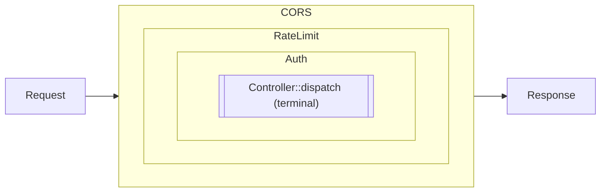
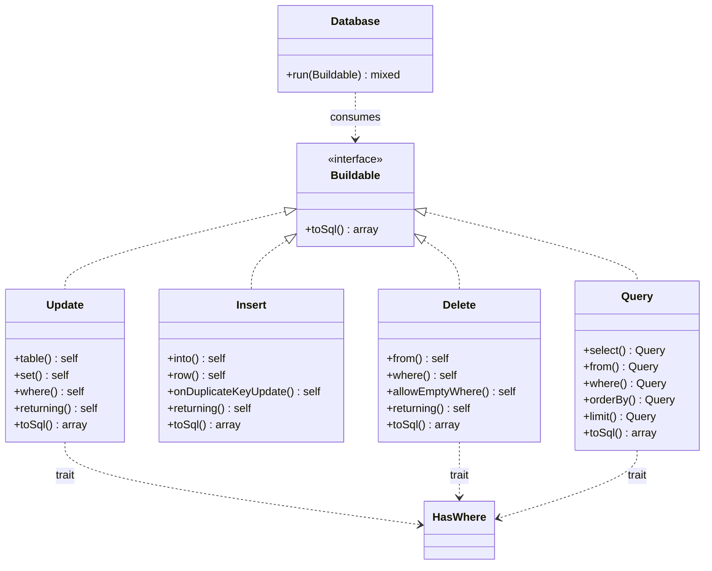

# Building blocks

Small, composable primitives that apps stitch together as needed.
Each one fits in a single file and has no runtime dependencies
beyond what the framework already carries.

## `Rxn\Framework\Http\Pipeline` + `Middleware`

Chain cross-cutting concerns around the terminal handler (usually a
controller dispatcher).

```php
use Rxn\Framework\Http\Pipeline;

$response = (new Pipeline())
    ->add($cors)
    ->add($rateLimit)
    ->add($auth)
    ->handle($request, fn ($req) => $controller->dispatch($req));
```

Middleware signature:

```php
public function handle(Request $request, callable $next): Response;
```

Return a `Response` without calling `$next` to short-circuit the
rest of the pipeline (e.g. rate-limit 429, auth 401).

Pipelines wrap the terminal handler onion-style: every middleware
runs its "before" code in registration order, the terminal fires
in the middle, and every "after" code runs in reverse order on the
way back out.



A short-circuit from any ring skips every inner ring — the
`Response` returned by that middleware travels straight back out
through the layers that have already run their before-code.

### Shipped middlewares

Three small, dependency-free middlewares cover the most common
defensive layers apps end up writing. Each one accepts injectable
emit-callables so they're unit-testable without PHP's global
`header()` / `http_response_code()` side effects.

#### `Rxn\Framework\Http\Middleware\Cors`

CORS policy + automatic preflight handling. Emits
`Access-Control-Allow-Origin` / `-Methods` / `-Headers` / `-Max-Age`
on every response, and short-circuits `OPTIONS` with a 204 before
the request reaches the controller.

```php
use Rxn\Framework\Http\Middleware\Cors;

$pipeline->add(new Cors(
    allowOrigins: ['https://app.example.com'],
    allowMethods: ['GET', 'POST', 'PUT', 'DELETE'],
    allowHeaders: ['Content-Type', 'Authorization'],
    maxAge:       3600,
));
```

Pass `['*']` to reflect any origin. `allowCredentials: true` flips
the behaviour to echo the incoming `Origin` so browsers accept the
response (they reject `*` + credentials).

#### `Rxn\Framework\Http\Middleware\RequestId`

Correlation id per request. Honours incoming `X-Request-ID` when it
matches `/^[A-Za-z0-9._-]{8,128}$/`; otherwise mints a UUIDv4.
Echoes the id back on the response and exposes it to downstream
code via `RequestId::current()` — handy for tagging log lines.

```php
use Rxn\Framework\Http\Middleware\RequestId;

$pipeline->add(new RequestId());
// later, in a controller or logger:
$log->info('order.created', ['request_id' => RequestId::current()]);
```

#### `Rxn\Framework\Http\Middleware\JsonBody`

Decodes `application/json` request bodies on `POST` / `PUT` /
`PATCH` into `$_POST`. Enforces a size cap (default 1 MiB) and maps
the predictable failure modes to HTTP codes: `413` for an
oversized body, `415` for a mismatched `Content-Type`, `400` for
invalid JSON or a non-object / non-array top-level value.

```php
use Rxn\Framework\Http\Middleware\JsonBody;

$pipeline->add(new JsonBody(maxBytes: 2 * 1024 * 1024));
// controllers read decoded fields via the usual collector API:
$name = $request->getCollector()->getParamFromPost('name');
```

Non-body methods (`GET`, `HEAD`, `DELETE`, `OPTIONS`) pass through
untouched; requests without a `Content-Type` pass through as
empty bodies.

#### `Rxn\Framework\Http\Middleware\ETag`

Conditional-GET support. After the downstream handler runs, hashes
the response payload (the envelope's `data` only — per-request
`meta.elapsed_ms` would otherwise invalidate every entry), emits
the weak ETag, and short-circuits to `304 Not Modified` when the
client's `If-None-Match` matches.

```php
use Rxn\Framework\Http\Middleware\ETag;

$pipeline->add(new ETag());
```

Scoped to successful `GET` / `HEAD` responses; everything else
(POST/PUT/DELETE, errors, null payloads) passes through untouched.
The wildcard `If-None-Match: *` is honoured. Zero configuration —
drop it in and GET-heavy endpoints stop retransmitting unchanged
payloads.

#### `Rxn\Framework\Http\Middleware\Idempotency`

Stripe-style idempotency for mutating endpoints. Clients send an
`Idempotency-Key: <uuid>` header; the middleware stores the
response keyed by `(key, sha256(method + URI + body))` and replays
on retry. Out-of-the-box backend is file-based (zero
dependencies); apps with Redis/Memcached/APCu wire in the duck-
typed PSR-16 bridge.

```php
use Rxn\Framework\Http\Idempotency\FileIdempotencyStore;
use Rxn\Framework\Http\Idempotency\Psr16IdempotencyStore;
use Rxn\Framework\Http\Middleware\Idempotency;

// Default — file backend, single-host:
$pipeline->add(new Idempotency(
    new FileIdempotencyStore('/var/run/rxn/idempotency'),
));

// With any PSR-16-shaped cache (no psr/simple-cache dependency
// in Rxn — the constructor parameter is `object`, validated
// structurally):
$pipeline->add(new Idempotency(
    new Psr16IdempotencyStore($yourPsr16Cache),
));
```

Five paths through the middleware:

| Situation | Outcome |
|---|---|
| No header on request | Pass through; middleware does nothing |
| GET / HEAD / OPTIONS (configurable) | Pass through; idempotency only applies to mutations |
| Cold key | Process the request, store the response with TTL, return |
| Replay (same key, same body) | Return stored response with `Idempotent-Replayed: true` header |
| Replay (same key, **different** body) | 400 Problem Details — `idempotency_key_in_use_with_different_body` |
| Concurrent retry while in-flight | 409 Conflict — `idempotency_key_in_use` |

Defaults: `Idempotency-Key` header name, 24h response TTL, 30s
lock TTL, applies to `POST` / `PUT` / `PATCH` / `DELETE`. All
configurable via constructor args. 5xx responses are
deliberately **not** cached so retries can hit a healthy backend
once it recovers.

To run a custom Redis client without the PSR-16 bridge,
implement `Rxn\Framework\Http\Idempotency\IdempotencyStore`
(four methods: `lock`, `release`, `get`, `put`). Backed by
Redis's `SET key value NX EX ttl`, the lock acquisition becomes
properly atomic.

## PSR-7 / PSR-15 bridge

`Rxn\Framework\Http\PsrAdapter` and `Psr15Pipeline` let apps opt
into the PSR middleware ecosystem without giving up the rest of
Rxn.

```php
use Rxn\Framework\Http\PsrAdapter;
use Rxn\Framework\Http\Psr15Pipeline;

$request = PsrAdapter::serverRequestFromGlobals();

$pipeline = (new Psr15Pipeline())
    ->add(new SomePsr15Middleware())       // any psr/http-server-middleware
    ->add(new AnotherPsr15Middleware());

$response = $pipeline->run($request, $controllerHandler);
PsrAdapter::emit($response);
```

`PsrAdapter::factory()` returns Nyholm's PSR-17 factory (which
implements every PSR-17 interface) in case you need to build
requests or responses by hand.

## `Rxn\Framework\Http\Router`

Explicit pattern routing; see [`routing.md`](routing.md).

## `Rxn\Framework\Service\Auth`

Bearer-token resolver. Register a closure in app bootstrap that
maps a token to a principal; call `extractBearer` + `resolve` from
middleware or a controller that needs auth.

```php
$auth = $container->get(\Rxn\Framework\Service\Auth::class);
$auth->setResolver(function (string $token): ?array {
    return $userRepo->findByToken($token);
});

$token = $auth->extractBearer($request->header('Authorization'));
$user  = $auth->resolve($token);
if ($user === null) {
    throw new \Exception('Unauthorized', 401);
}
```

## `Rxn\Framework\Http\Router\Session`

CSRF synchronizer tokens:

```php
Session::token();                   // lazy 32-byte hex
Session::validateToken($submitted); // constant-time compare
```

## `Rxn\Framework\Utility\Validator`

Small rule-based input validator. Keyword rules, `name:arg` rules,
or callables; no reflection, no magic.

```php
Validator::assert(
    $request->getCollector()->getFromRequest(),
    [
        'email' => ['required', 'email'],
        'age'   => ['required', 'int', 'min:18'],
        'role'  => ['in:admin,member,guest'],
        'slug'  => ['regex:/^[a-z0-9-]+$/'],
    ]
);
```

`check()` returns `['field' => ['message', ...]]` for callers that
want to shape the error response themselves. `assert()` throws
`\InvalidArgumentException` with a compact message and is the
normal boundary check inside a controller.

## `Rxn\Framework\Utility\Logger`

Append-only JSON-lines logger with PSR-3-style level helpers.

```php
$log = new Logger('/var/log/rxn/app.log');
$log->info('order.created', ['order_id' => $id, 'user_id' => $user['id']]);
```

## `Rxn\Framework\Utility\RateLimiter`

File-backed fixed-window limiter, locked with `flock`.

```php
$rl = new RateLimiter('/tmp/rxn-rate', limit: 60, window: 60);
if (!$rl->allow($request->clientIp())) {
    throw new \Exception('Too Many Requests', 429);
}
```

Swap for a Redis implementation behind the same surface when
horizontal scaling demands it.

## `Rxn\Framework\Utility\Scheduler`

Interval- or predicate-based in-process scheduler with JSON state
persistence. Drive from cron or a long-running worker.

```php
$s = new Scheduler('/var/lib/rxn/scheduler.json');
$s->every(60, 'purge-query-cache', fn () => $db->clearCache());
$s->at(fn ($now) => (int)date('G', $now) === 3, 'nightly-report', $reportJob);
$s->run();
```

## `Rxn\Framework\Data\Migration`

File-based SQL migrations, tracked in `rxn_migrations`. Files are
applied in lexicographic order; re-runs are idempotent.

```php
(new Migration($database, '/app/db/migrations'))->run();
```

Name files `NNNN_description.sql` for predictable ordering.

## `Rxn\Framework\Data\Chain`

Foreign-key relationship graph built from a `Map`.

```php
$chain = new Chain($map);
foreach ($chain->belongsTo('orders') as $link) {
    // $link->toTable, $link->toColumn
}
foreach ($chain->hasMany('users') as $link) {
    // $link->fromTable, $link->fromColumn
}
```

Links are immutable `Link` value objects derived from
`information_schema` reflection.

## `Rxn\Framework\Model\ActiveRecord`

Minimal active-record layer on top of the `rxn-orm` query builder.
Subclasses declare their table via `const TABLE`; `find()` returns
a hydrated instance; relationship methods return `Query` instances
callers compose.

```php
use Rxn\Framework\Model\ActiveRecord;
use Rxn\Orm\Builder\Query;

class User extends ActiveRecord {
    public const TABLE = 'users';
    public function orders(): Query    { return $this->hasMany(Order::class, 'user_id'); }
    public function role(): Query      { return $this->belongsTo(Role::class, 'role_id'); }
}

class Order extends ActiveRecord { public const TABLE = 'orders'; }
class Role  extends ActiveRecord { public const TABLE = 'roles'; }

$user = User::find($database, 42);          // null if no match
echo $user->email;                           // __get on hydrated attributes

$orderRows = $database->run(
    $user->orders()->andWhere('total', '>=', 100)->orderBy('id', 'DESC')
);
$orders = ActiveRecord::hydrate($orderRows, Order::class);

$role = $database->run($user->role())[0] ?? null;
```

Static entry points:

- `Foo::find($database, $id)` — fetch and hydrate, or null.
- `Foo::query()` — fresh SELECT `Query` scoped to this table.
- `Foo::hydrate($rows, Class::class)` — hydrate raw rows into
  instances; useful after calling `$database->run(...)`.

Instance methods:

- `$record->id()` — primary-key value.
- `$record->toArray()` — raw attributes.
- `$record->hasMany(Class::class, 'fk')` / `hasOne` / `belongsTo`
  — each returns a composable `Query`.

The layer is deliberately read-oriented. Persistence goes through
the `Insert` / `Update` / `Delete` builders and `Database::run()`;
if your app wants an Eloquent-style `$user->save()`, add it as a
thin layer on top.

## ORM / query builder (`davidwyly/rxn-orm`)

Shipped as a separate composer package — see
[davidwyly/rxn-orm](https://github.com/davidwyly/rxn-orm) — and
required transitively by Rxn. `Database::run($builder)` takes any
`Rxn\Orm\Builder\Buildable` (`Query`, `Insert`, `Update`, `Delete`)
and executes it.



Every builder returns a `[string $sql, array $bindings]` pair from
`toSql()`; callers that want to skip `Database::run()` can feed
that tuple to any PDO connection directly.

### `Rxn\Orm\Builder\Query`

Fluent SELECT query builder for cases where `Record` scaffolding
doesn't reach. `toSql()` materializes to `[$sql, $bindings]`;
`Database::run($query)` executes the result in one call.

```php
$query = (new Query())
    ->select(['u.id', 'u.email'])
    ->from('users', 'u')
    ->leftJoin('orders', 'o.user_id', '=', 'u.id', 'o')
    ->where('u.active', '=', 1)
    ->andWhereIn('u.role', ['admin', 'owner'])
    ->orderBy('u.created_at', 'DESC')
    ->limit(50)
    ->offset(0);

$rows = $database->run($query);
```

Grouped conditions use a closure argument that receives a fresh
`Query`; its where-calls become a parenthesised sub-expression:

```php
$query->where('tenant_id', '=', 7)
      ->andWhere('status', '=', 'active', function (Query $w) {
          $w->orWhere('status', '=', 'trial');
      });
// ... WHERE `tenant_id` = ? AND (`status` = ? OR `status` = ?)
```

Supported methods: `select`, `from`, `join` / `innerJoin` / `leftJoin` /
`rightJoin` / `joinCustom`, `where` / `andWhere` / `orWhere` /
`whereIn` / `whereNotIn` / `whereIsNull` / `whereIsNotNull` (and
`and*` / `or*` variants), `groupBy`, `having`, `orderBy`, `limit`,
`offset`. Operators validated against the `WHERE_OPERATORS`
whitelist (`=`, `!=`, `<>`, `<`, `<=`, `>`, `>=`, `IN`, `NOT IN`,
`LIKE`, `NOT LIKE`, `BETWEEN`, `REGEXP`, `NOT REGEXP`).

### Raw expressions

`Rxn\Orm\Builder\Raw` is an opt-out marker for SQL fragments the
builder should emit verbatim instead of identifier-escaping. Use it
for aggregates, function calls, and literals:

```php
use Rxn\Orm\Builder\Raw;

$q->select([Raw::of('COUNT(o.id) AS order_count'), 'u.id'])
  ->from('users', 'u')
  ->leftJoin('orders', 'o.user_id', '=', 'u.id', 'o')
  ->groupBy(Raw::of('DATE(o.created_at)'))
  ->orderBy(Raw::of('RAND()'));
```

Contents are not sanitised — don't interpolate user input into a
`Raw`. Accepted in `select()` columns, `groupBy`, `orderBy`, and as
values in `Insert::row()` / `Update::set()`.

### Insert / Update / Delete

Fluent mutation builders that share `Query`'s where-clause API via
the `HasWhere` trait. Each implements `Buildable`; pass one to
`Database::run()` to execute.

```php
// INSERT (single or multi-row; missing columns bind as null)
$database->run(
    (new \Rxn\Orm\Builder\Insert())
        ->into('users')
        ->row(['email' => 'a@example.com', 'role' => 'admin'])
        ->row(['email' => 'b@example.com', 'role' => 'member'])
);

// UPDATE
$database->run(
    (new \Rxn\Orm\Builder\Update())
        ->table('users')
        ->set(['role' => 'admin', 'updated_at' => Raw::of('NOW()')])
        ->where('id', '=', 42)
);

// DELETE (empty WHERE is blocked by default — opt in explicitly)
$database->run(
    (new \Rxn\Orm\Builder\Delete())
        ->from('users')
        ->where('deleted_at', '<', '2025-01-01')
);
```

`Delete::allowEmptyWhere()` enables `DELETE FROM t` without a
`WHERE` clause — it has to be called explicitly so a forgotten
condition can't accidentally wipe the table.

### Upsert (`ON DUPLICATE KEY UPDATE`, MySQL)

```php
$database->run(
    (new Insert())
        ->into('counters')
        ->row(['key' => 'pageviews', 'value' => 1])
        ->onDuplicateKeyUpdate(['value' => Raw::of('value + 1')])
);
// INSERT INTO `counters` (`key`, `value`) VALUES (?, ?)
// ON DUPLICATE KEY UPDATE `value` = value + 1
```

### `RETURNING` (PostgreSQL / SQLite)

All three mutation builders accept `->returning('col', ...)`;
columns are backtick-escaped, or pass `Raw::of(...)` for arbitrary
projections. MySQL will reject the statement — callers are
responsible for knowing their driver supports `RETURNING`.

### Subqueries

Three entry points; every variant merges the subquery's bindings
into the outer query's positional-binding list at call time.

```php
// WHERE col IN (SELECT ...)
$admins = (new Query())->select(['id'])->from('users')->where('role', '=', 'admin');
$q = (new Query())->select()->from('posts')
    ->where('author_id', 'IN', $admins);

// WHERE col = (SELECT ...)  — scalar subquery on the value side
$latest = (new Query())->select([Raw::of('MAX(id)')])->from('orders');
$q = (new Query())->select()->from('orders')->where('id', '=', $latest);

// FROM (SELECT ...) AS alias
$frequent = (new Query())
    ->select(['user_id', Raw::of('COUNT(*) AS order_count')])
    ->from('orders')->groupBy('user_id')->having('COUNT(*) > 5');
$q = (new Query())->select()->from($frequent, 'frequent')
    ->where('order_count', '>', 10);

// (SELECT ...) AS col  as a projected column
$orderCount = (new Query())->select([Raw::of('COUNT(*)')])
    ->from('orders')->where('user_id', '=', Raw::of('u.id'));
$q = (new Query())->select(['u.id'])
    ->selectSubquery($orderCount, 'order_count')
    ->from('users', 'u');
```

`selectSubquery` should be called before outer `where()` / etc
so its placeholders land ahead of later clauses in the
positional-binding list.

## Query-result caching

```php
$database->setCache('/var/cache/rxn/query', ttl: 300);
$database->enableCache();
```

Every read Query hits the filesystem cache first, keyed by
`md5(type|sql|bindings)`. Writes (INSERT/UPDATE/DELETE/DDL) are
never cached.

## `Rxn\Framework\Testing\TestClient` + `TestResponse`

In-process HTTP client for testing. Feeds a `Router` + a
caller-supplied dispatcher and returns a `TestResponse` with
fluent PHPUnit-integrated assertions — no web server, no curl, no
process boundary.

```php
use Rxn\Framework\Testing\TestClient;

$client = new TestClient($router, function (array $hit, Request $req) use ($container) {
    [$class, $method] = $hit['handler'];
    return $container->get($class)->{$method}(...array_values($hit['params']));
});

$client->get('/products/42')
       ->assertOk()
       ->assertJsonPath('data.id', 42)
       ->assertJsonStructure(['data' => ['id', 'name'], 'meta' => ['success']]);

$client->post('/products', ['name' => 'widget'], ['Content-Type' => 'application/json'])
       ->assertCreated();
```

Verbs: `get`, `post`, `put`, `patch`, `delete`. Query strings on
the path are parsed into `$_GET`; request bodies land in `$_POST`;
headers land in `$_SERVER['HTTP_*']` — so middleware that sniffs
the superglobals (Cors, RequestId, JsonBody, etc.) sees what it
would see in production.

Assertion helpers on `TestResponse`:

| Method | Behaviour |
|---|---|
| `assertStatus(int)` / `assertOk()` / `assertCreated()` / etc | HTTP status checks |
| `assertJsonPath(string, mixed)` | dotted-path equality (`data.user.id`) |
| `assertJsonStructure(array)` | recursive shape check; numeric keys mean "every element" |
| `response()` | escape hatch — raw `Response` for custom assertions |
| `status()` / `data()` / `json()` | accessors on the underlying envelope |

For tests that only exercise middleware, pass a trivial dispatcher
that returns a canned `Response` — routing + pipeline wire up the
same way either way.

## `Rxn\Framework\Http\OpenApi\SwaggerUi`

Interactive docs in one line. Pairs with the OpenAPI `Generator`
— point the UI at wherever you serve the spec JSON and you're
done.

```php
use Rxn\Framework\Http\OpenApi\{Generator, SwaggerUi};

$router->get('/openapi.json', fn () =>
    json_encode((new Generator(controllers: $controllers))->generate()));
$router->get('/docs', fn () => SwaggerUi::html('/openapi.json'));
```

Pulls `swagger-ui-dist@5` from `unpkg` by default; pass
`cdnBase: 'https://cdn.example.com/swagger/'` to self-host. Title
and spec URL are HTML-escaped at render time.

## `Rxn\Framework\Data\Filecache`

Object caching with atomic writes. Useful for caching anything
reflection-derived so you don't recompute on every request.
