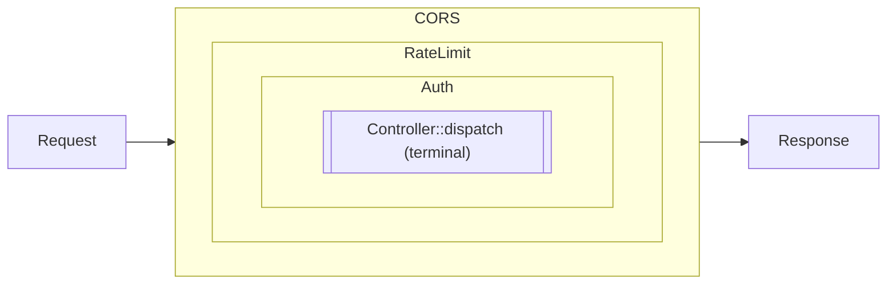

# Building blocks

Small, composable primitives that apps stitch together as needed.
Each one fits in a single file and has no runtime dependencies
beyond what the framework already carries.

## `Rxn\Framework\Http\Pipeline` + `Middleware`

Chain cross-cutting concerns around the terminal handler (usually a
controller dispatcher).

```php
use Rxn\Framework\Http\Pipeline;

$response = (new Pipeline())
    ->add($cors)
    ->add($rateLimit)
    ->add($auth)
    ->handle($request, fn ($req) => $controller->dispatch($req));
```

Middleware signature:

```php
public function handle(Request $request, callable $next): Response;
```

Return a `Response` without calling `$next` to short-circuit the
rest of the pipeline (e.g. rate-limit 429, auth 401).

Pipelines wrap the terminal handler onion-style: every middleware
runs its "before" code in registration order, the terminal fires
in the middle, and every "after" code runs in reverse order on the
way back out.



A short-circuit from any ring skips every inner ring — the
`Response` returned by that middleware travels straight back out
through the layers that have already run their before-code.

### Shipped middlewares

Three small, dependency-free middlewares cover the most common
defensive layers apps end up writing. Each one accepts injectable
emit-callables so they're unit-testable without PHP's global
`header()` / `http_response_code()` side effects.

#### `Rxn\Framework\Http\Middleware\Cors`

CORS policy + automatic preflight handling. Emits
`Access-Control-Allow-Origin` / `-Methods` / `-Headers` / `-Max-Age`
on every response, and short-circuits `OPTIONS` with a 204 before
the request reaches the controller.

```php
use Rxn\Framework\Http\Middleware\Cors;

$pipeline->add(new Cors(
    allowOrigins: ['https://app.example.com'],
    allowMethods: ['GET', 'POST', 'PUT', 'DELETE'],
    allowHeaders: ['Content-Type', 'Authorization'],
    maxAge:       3600,
));
```

Pass `['*']` to reflect any origin. `allowCredentials: true` flips
the behaviour to echo the incoming `Origin` so browsers accept the
response (they reject `*` + credentials).

#### `Rxn\Framework\Http\Middleware\RequestId`

Correlation id per request. Honours incoming `X-Request-ID` when it
matches `/^[A-Za-z0-9._-]{8,128}$/`; otherwise mints a UUIDv4.
Echoes the id back on the response and exposes it to downstream
code via `RequestId::current()` — handy for tagging log lines.

```php
use Rxn\Framework\Http\Middleware\RequestId;

$pipeline->add(new RequestId());
// later, in a controller or logger:
$log->info('order.created', ['request_id' => RequestId::current()]);
```

#### `Rxn\Framework\Http\Middleware\JsonBody`

Decodes `application/json` request bodies on `POST` / `PUT` /
`PATCH` into `$_POST`. Enforces a size cap (default 1 MiB) and maps
the predictable failure modes to HTTP codes: `413` for an
oversized body, `415` for a mismatched `Content-Type`, `400` for
invalid JSON or a non-object / non-array top-level value.

```php
use Rxn\Framework\Http\Middleware\JsonBody;

$pipeline->add(new JsonBody(maxBytes: 2 * 1024 * 1024));
// controllers read decoded fields via the usual collector API:
$name = $request->getCollector()->getParamFromPost('name');
```

Non-body methods (`GET`, `HEAD`, `DELETE`, `OPTIONS`) pass through
untouched; requests without a `Content-Type` pass through as
empty bodies.

#### `Rxn\Framework\Http\Middleware\ETag`

Conditional-GET support. After the downstream handler runs, hashes
the response payload (the envelope's `data` only — per-request
`meta.elapsed_ms` would otherwise invalidate every entry), emits
the weak ETag, and short-circuits to `304 Not Modified` when the
client's `If-None-Match` matches.

```php
use Rxn\Framework\Http\Middleware\ETag;

$pipeline->add(new ETag());
```

Scoped to successful `GET` / `HEAD` responses; everything else
(POST/PUT/DELETE, errors, null payloads) passes through untouched.
The wildcard `If-None-Match: *` is honoured. Zero configuration —
drop it in and GET-heavy endpoints stop retransmitting unchanged
payloads.

#### `Rxn\Framework\Http\Middleware\Idempotency`

Stripe-style idempotency for mutating endpoints. Clients send an
`Idempotency-Key: <uuid>` header; the middleware stores the
response keyed by `(key, sha256(method + URI + body))` and replays
on retry. Out-of-the-box backend is file-based (zero
dependencies); apps with Redis/Memcached/APCu wire in the duck-
typed PSR-16 bridge.

```php
use Rxn\Framework\Http\Idempotency\FileIdempotencyStore;
use Rxn\Framework\Http\Idempotency\Psr16IdempotencyStore;
use Rxn\Framework\Http\Middleware\Idempotency;

// Default — file backend, single-host:
$pipeline->add(new Idempotency(
    new FileIdempotencyStore('/var/run/rxn/idempotency'),
));

// With any PSR-16-shaped cache (no psr/simple-cache dependency
// in Rxn — the constructor parameter is `object`, validated
// structurally):
$pipeline->add(new Idempotency(
    new Psr16IdempotencyStore($yourPsr16Cache),
));
```

Five paths through the middleware:

| Situation | Outcome |
|---|---|
| No header on request | Pass through; middleware does nothing |
| GET / HEAD / OPTIONS (configurable) | Pass through; idempotency only applies to mutations |
| Cold key | Process the request, store the response with TTL, return |
| Replay (same key, same body) | Return stored response with `Idempotent-Replayed: true` header |
| Replay (same key, **different** body) | 400 Problem Details — `idempotency_key_in_use_with_different_body` |
| Concurrent retry while in-flight | 409 Conflict — `idempotency_key_in_use` |

Defaults: `Idempotency-Key` header name, 24h response TTL, 30s
lock TTL, applies to `POST` / `PUT` / `PATCH` / `DELETE`. All
configurable via constructor args. 5xx responses are
deliberately **not** cached so retries can hit a healthy backend
once it recovers.

To run a custom Redis client without the PSR-16 bridge,
implement `Rxn\Framework\Http\Idempotency\IdempotencyStore`
(four methods: `lock`, `release`, `get`, `put`). Backed by
Redis's `SET key value NX EX ttl`, the lock acquisition becomes
properly atomic.

#### `Rxn\Framework\Http\Middleware\BearerAuth`

Stateless `Authorization: Bearer <token>` enforcement. Wraps a
caller-supplied resolver — keeps the actual lookup (database,
JWT verify, OAuth introspect) in one place and lets the pipeline
decide *where* the check fires. On a valid token, the resolved
principal is exposed via `BearerAuth::current()` for downstream
code; on a missing / malformed / unrecognised token, the
middleware short-circuits to `401 unauthorized` Problem Details.

```php
use Rxn\Framework\Http\Middleware\BearerAuth;

$resolver = fn (string $token) => $userRepo->findByToken($token);
$pipeline->add(new BearerAuth($resolver));

// inside a controller:
$user = BearerAuth::current();
```

`current()` is cleared in the middleware's `finally`, so a
long-lived worker (RoadRunner / Swoole / FrankenPHP) can't leak
the previous request's principal into the next.

#### `Rxn\Framework\Http\Middleware\Pagination`

Parse-and-emit pagination for list endpoints. Two responsibilities:

```php
use Rxn\Framework\Http\Middleware\Pagination;
use Rxn\Framework\Http\Pagination\Pagination as Page;

$pipeline->add(new Pagination(defaultLimit: 25, maxLimit: 100));

// inside a controller:
$p = Page::current();
$rows  = $repo->fetch(limit: $p->limit, offset: $p->offset);
$total = $repo->count();
return [
    'data' => $rows,
    'meta' => ['total' => $total],   // ← middleware reads this
];
```

The middleware parses `?limit=&offset=` *or* `?page=&per_page=`
into a typed `Pagination` value object, clamps to
`[1, maxLimit]`, and exposes via `Pagination::current()`. After
the controller runs, if `meta.total` is set it emits
`X-Total-Count` and a RFC 8288 `Link: rel=first|prev|next|last`
header automatically. Controllers don't do pagination math.

## Health checks

#### `Rxn\Framework\Http\Health\HealthCheck`

Readiness / liveness route helper. Registers a closure-handler
route on a `Router`, runs a list of named checks, returns a
JSON envelope with per-check status:

```php
use Rxn\Framework\Http\Health\HealthCheck;

HealthCheck::register($router, '/health', [
    'database' => fn () => $db->getConnection() !== null,
    'cache'    => fn () => $cache->ping(),
    'queue'    => fn () => ['ok' => true, 'depth' => $q->depth()],
]);
```

Each check returns:

- `bool` — true = ok, false = fail
- `array` — passes through as the check body; `status: fail`
  marks the whole endpoint as failing, otherwise it's `ok`
- thrown `Throwable` — captured as `{ status: fail, error: <msg> }`

Returned body shape:

```json
{
  "status": "ok",
  "checks": {
    "database": { "status": "ok" },
    "cache":    { "status": "ok" },
    "queue":    { "status": "ok", "ok": true, "depth": 17 }
  },
  "meta": { "status": 200 }
}
```

`meta.status` reflects HTTP status (200 / 503) so a thin renderer
adapter can pick it up. `register()` returns the underlying
`Route`, so apps can chain `->name()` and `->middleware()` to
require auth on the endpoint.

## PSR-7 / PSR-15 bridge

`Rxn\Framework\Http\PsrAdapter` and `Psr15Pipeline` let apps opt
into the PSR middleware ecosystem without giving up the rest of
Rxn.

```php
use Rxn\Framework\Http\PsrAdapter;
use Rxn\Framework\Http\Psr15Pipeline;

$request = PsrAdapter::serverRequestFromGlobals();

$pipeline = (new Psr15Pipeline())
    ->add(new SomePsr15Middleware())       // any psr/http-server-middleware
    ->add(new AnotherPsr15Middleware());

$response = $pipeline->run($request, $controllerHandler);
PsrAdapter::emit($response);
```

`PsrAdapter::factory()` returns Nyholm's PSR-17 factory (which
implements every PSR-17 interface) in case you need to build
requests or responses by hand.

## `Rxn\Framework\Http\Router`

Explicit pattern routing; see [`routing.md`](routing.md).

## `Rxn\Framework\Utility\Logger`

Append-only JSON-lines logger with PSR-3-style level helpers.

```php
$log = new Logger('/var/log/rxn/app.log');
$log->info('order.created', ['order_id' => $id, 'user_id' => $user['id']]);
```

## `Rxn\Framework\Utility\RateLimiter`

File-backed fixed-window limiter, locked with `flock`.

```php
$rl = new RateLimiter('/tmp/rxn-rate', limit: 60, window: 60);
if (!$rl->allow($request->clientIp())) {
    throw new \Exception('Too Many Requests', 429);
}
```

Swap for a Redis implementation behind the same surface when
horizontal scaling demands it.

## `Rxn\Framework\Utility\Scheduler`

Interval- or predicate-based in-process scheduler with JSON state
persistence. Drive from cron or a long-running worker.

```php
$s = new Scheduler('/var/lib/rxn/scheduler.json');
$s->every(60, 'purge-query-cache', fn () => $db->clearCache());
$s->at(fn ($now) => (int)date('G', $now) === 3, 'nightly-report', $reportJob);
$s->run();
```

## Database / ORM / migrations

Shipped as the separate [`davidwyly/rxn-orm`](https://github.com/davidwyly/rxn-orm)
package — query builder, ActiveRecord-shaped layer, file-based
SQL migrations, query-result caching. `composer require davidwyly/rxn-orm`
to opt in; the framework itself stays storage-free.

## `Rxn\Framework\Testing\TestClient` + `TestResponse`

In-process HTTP client for testing. Feeds a `Router` + a
caller-supplied dispatcher and returns a `TestResponse` with
fluent PHPUnit-integrated assertions — no web server, no curl, no
process boundary.

```php
use Rxn\Framework\Testing\TestClient;

$client = new TestClient($router, function (array $hit, Request $req) use ($container) {
    [$class, $method] = $hit['handler'];
    return $container->get($class)->{$method}(...array_values($hit['params']));
});

$client->get('/products/42')
       ->assertOk()
       ->assertJsonPath('data.id', 42)
       ->assertJsonStructure(['data' => ['id', 'name'], 'meta' => ['success']]);

$client->post('/products', ['name' => 'widget'], ['Content-Type' => 'application/json'])
       ->assertCreated();
```

Verbs: `get`, `post`, `put`, `patch`, `delete`. Query strings on
the path are parsed into `$_GET`; request bodies land in `$_POST`;
headers land in `$_SERVER['HTTP_*']` — so middleware that sniffs
the superglobals (Cors, RequestId, JsonBody, etc.) sees what it
would see in production.

Assertion helpers on `TestResponse`:

| Method | Behaviour |
|---|---|
| `assertStatus(int)` / `assertOk()` / `assertCreated()` / etc | HTTP status checks |
| `assertJsonPath(string, mixed)` | dotted-path equality (`data.user.id`) |
| `assertJsonStructure(array)` | recursive shape check; numeric keys mean "every element" |
| `response()` | escape hatch — raw `Response` for custom assertions |
| `status()` / `data()` / `json()` | accessors on the underlying envelope |

For tests that only exercise middleware, pass a trivial dispatcher
that returns a canned `Response` — routing + pipeline wire up the
same way either way.

## `Rxn\Framework\Http\OpenApi\SwaggerUi`

Interactive docs in one line. Pairs with the OpenAPI `Generator`
— point the UI at wherever you serve the spec JSON and you're
done.

```php
use Rxn\Framework\Http\OpenApi\{Generator, SwaggerUi};

$router->get('/openapi.json', fn () =>
    json_encode((new Generator(controllers: $controllers))->generate()));
$router->get('/docs', fn () => SwaggerUi::html('/openapi.json'));
```

Pulls `swagger-ui-dist@5` from `unpkg` by default; pass
`cdnBase: 'https://cdn.example.com/swagger/'` to self-host. Title
and spec URL are HTML-escaped at render time.

