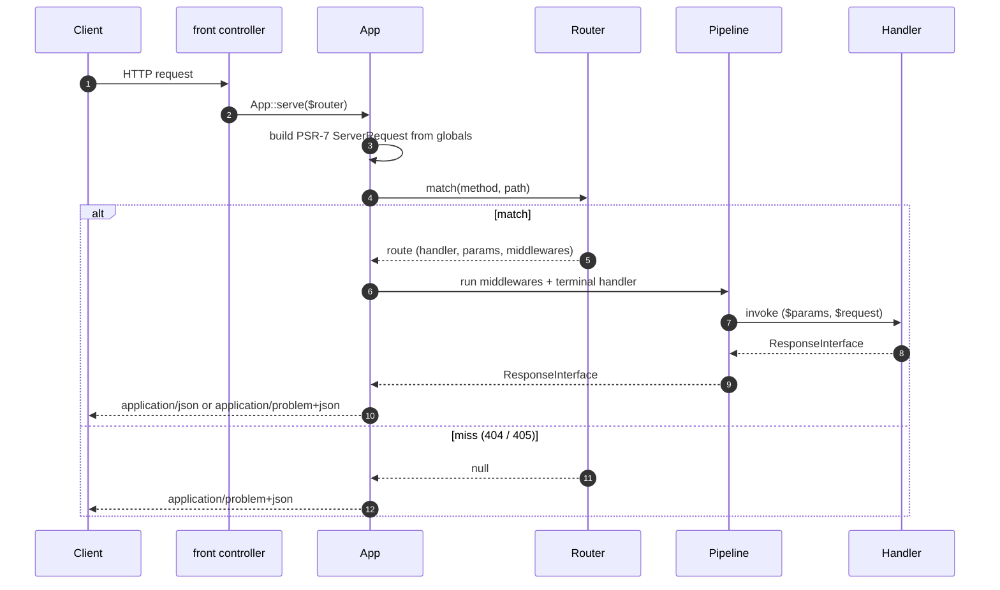

# Rxn documentation

Rxn is a small JSON API framework for PHP 8.2+. Five motives drive
every decision: **novelty, simplicity, interoperability, speed,
and strict JSON**.

These pages go into more depth than the top-level README quickstart.

## Request lifecycle

`App::serve(Router)` is the entry point. Boot-free — no
constructor, no Container plumbing, no DB connection during
request setup. The request flows through the configured Router
to find a matched route, the route's middleware pipeline runs,
and the matched handler is invoked. Success lands on the
`{data, meta}` envelope with `Content-Type: application/json`;
every uncaught exception either rolls back into a Problem Details
(`Content-Type: application/problem+json`) response from a
caller-installed exception middleware, or propagates past
`serve()` to the SAPI's default error path.

## Topics

| Topic | Notes |
|---|---|
| [Design philosophy](design-philosophy.md) | The ten principles that let Rxn be fast, readable, and small at the same time |
| [Routing](routing.md) | The explicit `Http\Router` + `#[Route]` attribute scanning |
| [Dependency injection](dependency-injection.md) | Container, autowiring, method injection |
| [Request binding + validation](request-binding.md) | DTO hydration + attribute-driven validation |
| [Error handling](error-handling.md) | Exceptions + RFC 7807 Problem Details |
| [Building blocks](building-blocks.md) | Pipeline + shipped middlewares, Logger, RateLimiter, Scheduler, TestClient, SwaggerUi |
| [PSR-7 / PSR-15 interop](psr-7-interop.md) | The framework's PSR-15 stance |
| [Horizons](horizons.md) | Research directions that could reposition the framework — schema as truth taken further, observability ships in the box (event surface + plugin), fiber-aware concurrency (proven), profile-guided compilation (proven). Each direction sized with cost, mechanism, and ship signal. |
| [Plugin architecture](plugin-architecture.md) | First-party plugins as the unit of trust extension. Repository / versioning conventions, the parity-harness contract. |
| [CLI](cli.md) | `bin/rxn` — OpenAPI spec, route conflict checks, dump:hot |
| [Benchmarks](benchmarks.md) | `bin/bench` — microbenchmarks for the building blocks |
| [OPcache preload](opcache-preload.md) | `bin/preload.php` — pre-compile the framework at fpm boot |

The full list of features and their implementation status lives in
the top-level [README](../README.md). Framework-level conventions
and contribution guidance live in [CONTRIBUTING.md](../CONTRIBUTING.md).
