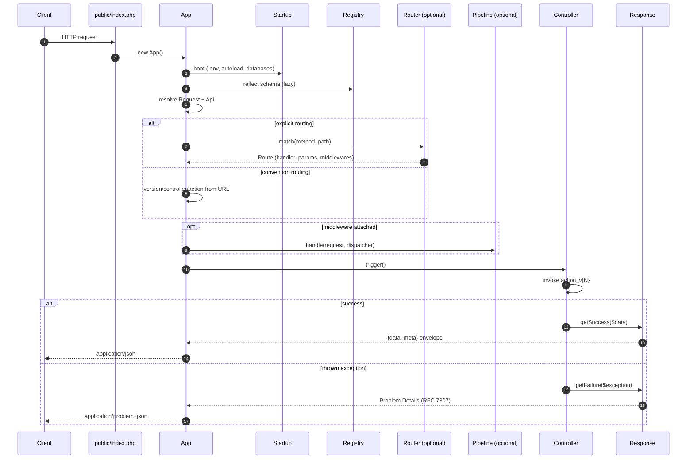

# Rxn documentation

Rxn is a small JSON API framework for PHP 8.2+. Five motives drive
every decision: **novelty, simplicity, interoperability, speed,
and strict JSON**.

These pages go into more depth than the top-level README quickstart.

## Request lifecycle

A single request enters through `public/index.php`, boots the
environment via `Startup`, then flows through the optional router
and middleware pipeline before landing at a controller action.
Success lands on the `{data, meta}` envelope with
`Content-Type: application/json`; every uncaught exception rolls
back into `Response::getFailure` and renders as an RFC 7807
Problem Details document with `Content-Type:
application/problem+json`. Those are the only two exit paths.

## Topics

| Topic | Notes |
|---|---|
| [Design philosophy](design-philosophy.md) | The ten principles that let Rxn be fast, readable, and small at the same time |
| [Routing](routing.md) | Convention-based URLs and the explicit `Router` |
| [Dependency injection](dependency-injection.md) | Container, autowiring, method injection |
| [Request binding + validation](request-binding.md) | DTO hydration + attribute-driven validation |
| [Scaffolding](scaffolding.md) | Auto-CRUD endpoints against a live schema |
| [Error handling](error-handling.md) | Exceptions + RFC 7807 Problem Details |
| [Building blocks](building-blocks.md) | Pipeline + shipped middlewares, Logger, RateLimiter, Scheduler, Auth, Migration, Chain, TestClient, SwaggerUi |
| [PSR-7 / PSR-15 interop](psr-7-interop.md) | The framework's PSR-15 stance and the bench evidence behind the ingress cost analysis (page predates the PSR-15 native migration — see CHANGELOG) |
| [Horizons](horizons.md) | Research directions that could reposition the framework — schema as truth taken further, observability ships in the box, fiber-aware concurrency (already proven), profile-guided compilation. Each direction sized with cost, mechanism, and ship signal. |
| [Plugin architecture](plugin-architecture.md) | First-party plugins as the unit of trust extension. Repository / versioning conventions, the parity-harness contract. |
| [CLI](cli.md) | `bin/rxn` — migrations, scaffolding, OpenAPI spec |
| [Benchmarks](benchmarks.md) | `bin/bench` — microbenchmarks for the building blocks |
| [OPcache preload](opcache-preload.md) | `bin/preload.php` — pre-compile the framework at fpm boot |

The full list of features and their implementation status lives in
the top-level [README](../README.md). Framework-level conventions
and contribution guidance live in [CONTRIBUTING.md](../CONTRIBUTING.md).
