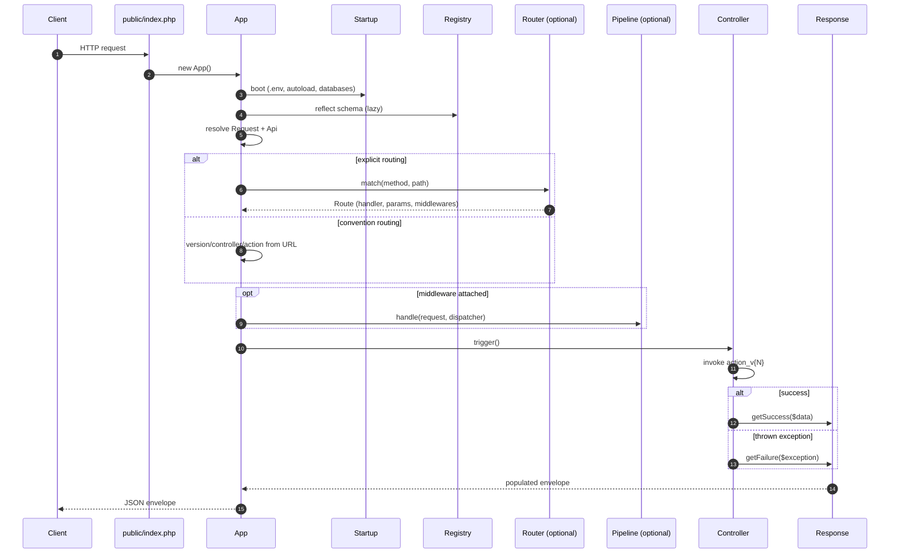

# Rxn documentation

Rxn is a small JSON API framework for PHP 8.2+. The goal, in order,
is **fast**, **minimal**, and **easy to use**.

These pages go into more depth than the top-level README quickstart.

## Request lifecycle

A single request enters through `public/index.php`, boots the
environment via `Startup`, then flows through the optional router
and middleware pipeline before landing at a controller action.
Every uncaught exception rolls back into `Response::getFailure`
and renders as the standard JSON envelope — there is no other exit
path.

## Topics

| Topic | Notes |
|---|---|
| [Routing](routing.md) | Convention-based URLs and the explicit `Router` |
| [Dependency injection](dependency-injection.md) | Container, autowiring, method injection |
| [Scaffolding](scaffolding.md) | Auto-CRUD endpoints against a live schema |
| [Error handling](error-handling.md) | Exceptions + JSON envelope |
| [Building blocks](building-blocks.md) | Logger, RateLimiter, Scheduler, Auth, Pipeline, Migration, Chain |
| [CLI](cli.md) | `bin/rxn` — migrations and scaffolding |
| [Benchmarks](benchmarks.md) | `bin/bench` — microbenchmarks for the building blocks |

The full list of features and their implementation status lives in
the top-level [README](../README.md). Framework-level conventions
and contribution guidance live in [CONTRIBUTING.md](../CONTRIBUTING.md).
